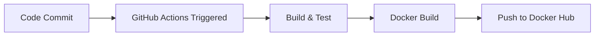
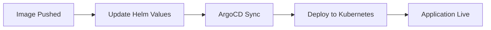

# 🚀 Todo App DevOps Deployment

A comprehensive full-stack todo application demonstrating modern DevOps practices with complete CI/CD pipeline, containerization, and Kubernetes orchestration.

## 🏗️ DevOps Architecture

This project showcases a complete DevOps implementation with:

- **🔄 CI/CD Pipeline**: GitHub Actions for automated builds and deployments
- **📦 Containerization**: Docker for application packaging
- **☸️ Kubernetes**: Container orchestration with Kind cluster
- **🎯 GitOps**: ArgoCD for continuous deployment
- **📊 Package Management**: Helm charts for Kubernetes deployments
- **🐳 Registry**: Docker Hub for container image storage

## 🛠️ Technology Stack

### Application Stack
- **Backend**: Node.js, Express.js
- **Frontend**: HTML5, CSS3, JavaScript
- **Package Manager**: npm

### DevOps Stack
- **Containerization**: Docker
- **Orchestration**: Kubernetes (Kind cluster)
- **CI/CD**: GitHub Actions
- **GitOps**: ArgoCD
- **Package Management**: Helm
- **Registry**: Docker Hub
- **Infrastructure as Code**: YAML manifests

## 🔧 Project Structure

```
todo-app-deployment/
├── 📁 .github/workflows/
│   └── ci.yaml                 # GitHub Actions CI/CD pipeline
├── 📁 helm/
│   └── fullstack-todo-app-charts/
│       ├── Chart.yaml          # Helm chart metadata
│       ├── values.yaml         # Helm values configuration
│       └── templates/
│           └── k8s-manifest.yaml # Kubernetes templates
├── 📁 scripts/                 # Deployment scripts
├── server.js                   # Main application server
├── package.json               # Node.js dependencies
├── Dockerfile                 # Container image definition
├── docker-compose.yml         # Local development setup
├── k8s-manifest.yaml          # Kubernetes deployment manifests
├── kind-cluster-config.yaml   # Kind cluster configuration
└── README.md                  # This file
```

## 🚀 DevOps Pipeline Flow

### 1. Development Phase


### 2. Deployment Phase


## 📋 Prerequisites

- [Docker](https://www.docker.com/) (v20.10+)
- [Kind](https://kind.sigs.k8s.io/) (v0.17+)
- [kubectl](https://kubernetes.io/docs/tasks/tools/) (v1.25+)
- [Helm](https://helm.sh/) (v3.10+)
- [ArgoCD CLI](https://argo-cd.readthedocs.io/en/stable/cli_installation/) (optional)
- [Node.js](https://nodejs.org/) (v18+)

## 🚦 Quick Start

### 1. Local Development

```bash
# Clone the repository
git clone https://github.com/vanshitsharma18/todo-app-deployment.git
cd todo-app-deployment

# Install dependencies
npm install

# Start development server
npm run dev
```

### 2. Docker Deployment

```bash
# Build and run with Docker Compose
docker-compose up --build

# Or build and run manually
docker build -t todo-app .
docker run -p 3000:3000 todo-app
```

### 3. Kubernetes Deployment with Kind

```bash
# Create Kind cluster
kind create cluster --config kind-cluster-config.yaml

# Deploy using Helm
helm install todo-app ./helm/fullstack-todo-app-charts

# Or deploy using kubectl
kubectl apply -f k8s-manifest.yaml
```

## ☸️ Kubernetes Configuration

### Kind Cluster Setup
The `kind-cluster-config.yaml` creates a multi-node cluster with:
- 1 Control plane node
- 2 Worker nodes
- Port mappings for external access (80, 443, 3000)

### Kubernetes Resources
- **Deployment**: 2 replicas with resource limits and health checks
- **Service**: NodePort service for internal cluster access
- **Ingress**: External access configuration with nginx
- **PVC**: Persistent storage for application data

## 🔄 CI/CD Pipeline

### GitHub Actions Workflow (`.github/workflows/ci.yaml`)

The pipeline includes:

1. **Build Stage**
   - Node.js environment setup
   - Dependency installation
   - Application build

2. **Code Quality Stage**
   - Linting (when configured)
   - Code quality checks

3. **Container Build & Push**
   - Docker image build
   - Multi-tag strategy (latest + build ID)
   - Push to Docker Hub

4. **GitOps Update**
   - Automatic Helm values update
   - Git commit with new image tag

### Pipeline Triggers
- Push to `master` branch
- Excludes documentation and helm changes to prevent infinite loops

## 🎯 GitOps with ArgoCD

### ArgoCD Configuration
ArgoCD monitors the Helm charts and automatically deploys changes:

```bash
# Install ArgoCD
kubectl create namespace argocd
kubectl apply -n argocd -f https://raw.githubusercontent.com/argoproj/argo-cd/stable/manifests/install.yaml

# Access ArgoCD UI
kubectl port-forward svc/argocd-server -n argocd 8080:443
```

### Application Sync
ArgoCD automatically detects changes in:
- Helm chart values
- Kubernetes manifests
- Application configuration

## 📊 Helm Charts

### Chart Structure
```yaml
# helm/fullstack-todo-app-charts/values.yaml
replicaCount: 1
image:
  repository: vanshitsharma07/fullstack-todo-app
  tag: "latest"
  pullPolicy: IfNotPresent
```

### Deployment Commands
```bash
# Install/Upgrade with Helm
helm upgrade --install todo-app ./helm/fullstack-todo-app-charts

# Rollback if needed
helm rollback todo-app 1
```

## 🐳 Container Registry

### Docker Hub Integration
- **Repository**: `vanshitsharma07/fullstack-todo-app`
- **Tagging Strategy**: 
  - `latest`: Most recent build
  - `{build-id}`: Specific build version

## 🔧 Configuration

### Environment Variables
```yaml
NODE_ENV: production
PORT: 3000
```

### Resource Limits
```yaml
resources:
  requests:
    memory: "128Mi"
    cpu: "100m"
  limits:
    memory: "256Mi"
    cpu: "200m"
```

## 🚀 Deployment Strategies

### Blue-Green Deployment
```bash
# Deploy new version
helm upgrade todo-app ./helm/fullstack-todo-app-charts --set image.tag=new-version

# Rollback if issues
helm rollback todo-app
```

### Canary Deployment
```bash
# Deploy canary version
helm upgrade todo-app ./helm/fullstack-todo-app-charts --set replicaCount=3 --set canary.enabled=true
```

## 🔍 Monitoring & Observability

### Health Checks
- **Liveness Probe**: `/api/todos` endpoint
- **Readiness Probe**: Application startup verification
- **Resource Monitoring**: CPU and memory usage

### Accessing the Application
```bash
# Port forward to access locally
kubectl port-forward svc/fullstack-todo-service 3000:3000

# Or access via ingress
curl http://todo-app.local
```

## 🧪 Testing

### Local Testing
```bash
npm test  # Run application tests
```

### Kubernetes Testing
```bash
# Check pod status
kubectl get pods

# Check service endpoints
kubectl get svc

# Check ingress
kubectl get ingress
```

## 📈 Scaling

### Horizontal Pod Autoscaler
```bash
kubectl autoscale deployment fullstack-todo-app --cpu-percent=50 --min=1 --max=10
```

### Manual Scaling
```bash
kubectl scale deployment fullstack-todo-app --replicas=5
```

## 🔧 Troubleshooting

### Common Issues
1. **Pod CrashLoopBackOff**: Check logs with `kubectl logs <pod-name>`
2. **Image Pull Errors**: Verify Docker Hub credentials
3. **Service Unreachable**: Check service and ingress configuration

### Debug Commands
```bash
# Check pod logs
kubectl logs -f deployment/fullstack-todo-app

# Debug pod
kubectl exec -it <pod-name> -- /bin/sh

# Check events
kubectl get events --sort-by=.metadata.creationTimestamp
```

## 🤝 Contributing

1. Fork the repository
2. Create a feature branch (`git checkout -b feature/amazing-feature`)
3. Commit your changes (`git commit -m 'Add amazing feature'`)
4. Push to the branch (`git push origin feature/amazing-feature`)
5. Open a Pull Request

## 📄 License

This project is licensed under the ISC License.

## 👤 Author

**Vanshit Sharma**
- GitHub: [@vanshitsharma18](https://github.com/vanshitsharma18)
- Docker Hub: [vanshitsharma07](https://hub.docker.com/u/vanshitsharma07)

## 🎯 DevOps Best Practices Demonstrated

- ✅ **Infrastructure as Code**: Kubernetes manifests and Helm charts
- ✅ **GitOps**: ArgoCD for declarative deployments
- ✅ **CI/CD**: Automated build, test, and deployment pipeline
- ✅ **Containerization**: Docker for consistent environments
- ✅ **Orchestration**: Kubernetes for container management
- ✅ **Monitoring**: Health checks and resource monitoring
- ✅ **Scaling**: Horizontal pod autoscaling capabilities
- ✅ **Security**: Resource limits and security contexts
- ✅ **Version Control**: Git-based workflow with proper branching

---

⭐ **Star this repository if you found it helpful for learning DevOps practices!**

🔗 **Useful Links:**
- [Kubernetes Documentation](https://kubernetes.io/docs/)
- [ArgoCD Documentation](https://argo-cd.readthedocs.io/)
- [Helm Documentation](https://helm.sh/docs/)
- [GitHub Actions Documentation](https://docs.github.com/en/actions)
